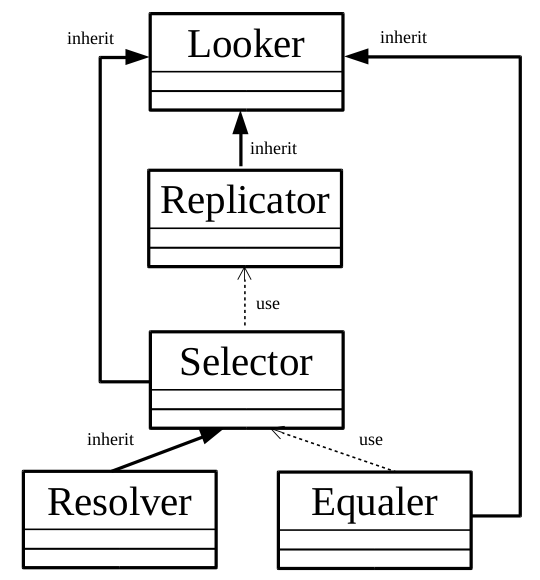

# wLooker  [](https://travis-ci.org/Wandalen/wLooker) [](https://ci.appveyor.com/project/Wandalen/wlooker)

Collection of light-weight routines to traverse complex data structure. The module takes care of cycles in a data structure( recursions ) and can be used for comparison or operation on several similar data structures, for replication. Several other modules used this to traverse abstract data structures.

## Class diagram



The diagram above displays the connections between classes Looker, [Replicator](https://github.com/Wandalen/wReplicator), [Selector](https://github.com/Wandalen/wSelector), [Resolver](https://github.com/Wandalen/wResolver) and [Equaler](https://github.com/Wandalen/wEqualer). The solid lines indicate inheritance between classes, where the arrow indicates the parent class. The dashed lines indicate the use of classes, where the arrow indicates the class used by another. The diagram shows that Looker is the basic class, and it's inherited by others.

## Try out

```
npm install
node sample/Sample.s
```


